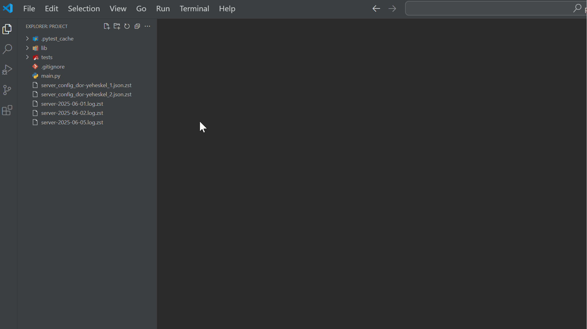

# ZST Viewer – Read compressed files right inside VS Code

Tiny extension that lets you open any **`.zst` text file** (CSV, JSON, logs, or any other compressed text) as plain text, with full syntax highlighting (e.g. `.log`, `.csv`, etc.).

  
   
  <i>▶ Example: open .zst files in VS Code</i>

---

> **TL;DR**  
> ✅ **Right-click** any `.zst` file (in the explorer) → **View decoded .zst file**  
> ✅ **Ctrl + Shift + P** → **ZST Viewer: View decoded file**  
> ✅ Instantly see the text (read-only) inside VS Code

---

## Why you might need it 🤕

* **The pain**  
  Someone sends you `server.log.zst` or `large.csv.zst` or any other text archive.  
  Opening it in VS Code shows only a grey *“binary file”* placeholder; the editor can’t display the contents.

* **What you do today without this extension**  
  Running an editor like VIM or Emacs can show the contents, but it’s not convenient.
  Alternatively, you have to:
  1. Run a command-line tool (`zstd -d` or similar or a Python script) to decompress.  
  2. Locate and open the new file in VS Code to get highlighting.

## What this extension gives you 🚀

**ZST Viewer** eliminates the manual decompression — one command inside VS Code opens the file with proper highlighting and keeps temporary files neatly in a dedicated cache folder.

| Feature                                      | Description                                               |
|----------------------------------------------|-----------------------------------------------------------|
| **Right-click ➜ View decoded .zst file**     | Opens the file with proper highlighting                   |
| **Ctrl + Shift + P ➜ ZST Viewer: View decoded file** | Asks you to pick a `.zst` file                             |
| **Smart on-disk cache**                      | Re-uses previous decompressions                            |
| **Cross-platform**                           | Pure JavaScript (`fzstd`), works on Linux, Windows, macOS, WSL, SSH |

## Quick start 🛠️

### 1. Install

   - 📦 From the Marketplace: search for **“ZST Viewer”**  
     *(extension ID: `zstd-viewer`)*
   - Or install manually via `.vsix`:  
     *Extensions ▸ ⋯ ▸ Install from VSIX*

### 2. Using the extension 

#### Right-click ➜ View decoded `.zst` file  

  
   
  <i>▶ Right-click on the .zst file to view decoded text</i>

#### Ctrl + Shift + P ➜ ZST Viewer: View decoded file  

  
   
  <i>▶ Open the Command Palette, type “ZST Viewer†(or just “zst”), and select a file</i>

## Under the hood 🔧

* Decompresses with **`fzstd`** (pure JS, no native code).
* Cache key = file **path + size + mtime** (no content hashing).
* Decoded files live in `<tmp path>/zst-viewer-of-<you>/` (read-only).
* Files > 500 MB (after decompression) ask for confirmation.

## Contributing / Issues 🤝

Found a bug? Need another feature? PRs are welcome.  
Please include:

* VS Code version  
* OS (and remote/WSL if relevant)  
* Steps to reproduce the issue
* Screenshots / GIFs if possible

## License 📄

This project is licensed under the MIT License. See [LICENSE](LICENSE) for details.